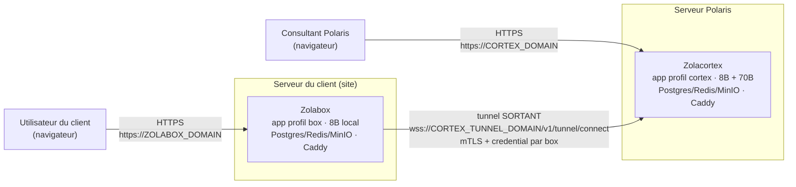

# Déploiement en production — ZolaOS (Zolacortex + Zolabox)

Runbook opérationnel pour déployer ZolaOS en production dans son modèle **hybride
Zero Trust** : le **Zolacortex** chez Polaris (le hub) et une **Zolabox** par client
(sur son serveur, données sur site). À suivre ligne par ligne, dans l'ordre.

Ce document ne recopie pas `deploy/OPERATIONS.md` ni `docs/PRODUCTION_HYBRID.md` —
il s'appuie dessus et y renvoie pour le détail. En cas de doute sur une variable ou
une commande, la source de vérité reste les fichiers sous `deploy/`.

> **Statut testé (à connaître avant de déployer en réel)** — d'après les README des
> bundles : les deux bundles Compose sont validés **au niveau configuration** (schéma
> Docker Compose, chaîne PKI vérifiée par `openssl verify`). La chaîne mTLS complète
> (Caddy `client_auth` + présentation du certificat par une vraie box) et
> l'installation de bout en bout sur des serveurs réels restent à valider en **phase
> pilote**. Traiter le premier déploiement client comme un pilote instrumenté, pas
> comme une opération de routine.

## 1. Introduction — le modèle hybride Zero Trust

ZolaOS se déploie en deux moitiés qui communiquent par un **tunnel sortant** :

| | Le client (Zolabox) | Polaris (Zolacortex) |
|---|---|---|
| Où | Sur le serveur du client (site) | Chez Polaris |
| Données | Restent sur place (Postgres/MinIO du client) | Ne reçoit que des extraits scopés, via tunnel, le temps d'une mission |
| Modèle LLM | **8B local** (`llama3:8b`) uniquement | **8B (routeur) + 70B** (analyse cabinet) |
| Prompts / overlays Polaris | **Jamais présents** (retirés au build, profil `box`) | Présents (profil `cortex`, image non « strippée ») |
| Connectivité | Ouvre une connexion **sortante** (wss) vers le cortex ; **aucun port entrant** pour le tunnel | Reçoit les tunnels sur un domaine dédié (mTLS) ; héberge le cockpit |
| Ce que fait l'utilisateur final | Se connecte en HTTPS, utilise l'assistant/modules sur ses données. Aucune manipulation Docker/technique. | Le consultant Polaris opère le cockpit, lance les missions |

Deux couches de sécurité protègent le tunnel (défense en profondeur, détaillées en
§9) : le **transport mTLS** (certificat client par box, terminé à Caddy côté cortex)
et le **credential applicatif par box** (haché, révocable immédiatement).



### Ordre de déploiement (vue d'ensemble)

1. **Déployer le Cortex** (§3) — c'est le hub ; il doit exister avant toute box.
2. **Provisionner chaque client** au cockpit (§4) : credential + certificat mTLS.
3. **Déployer la Zolabox** sur le serveur du client (§5), ou livrer une **appliance
   VM** clé en main (§6).
4. **Vérifier de bout en bout** (§7), puis passer en exploitation (§8-9).

## 2. Prérequis

### Matériel

| Côté | Cible | Détail |
|---|---|---|
| Cortex (Polaris) | **GPU** dimensionné pour le 70B résident, mutualisé sur toutes les missions | Le 70B « l'exige en pratique » (README cortex). Bloc `deploy.resources.reservations` (nvidia) commenté dans `deploy/zolacortex/docker-compose.yml`, service `ollama` — à décommenter (nécessite `nvidia-container-toolkit`). |
| Zolabox (client) | GPU d'entrée/milieu de gamme ou APU à mémoire unifiée pour le 8B + embeddings bge-m3 ; CPU seul fonctionne mais lentement | Idem, bloc `deploy` commenté dans `deploy/zolabox/docker-compose.yml`, service `ollama`. AMD ROCm : adapter le runtime. À affiner par un bench sur le matériel réel des clients cibles (`docs/PRODUCTION_HYBRID.md`, § Spécification matérielle). |

### Logiciel (les deux côtés)

- Linux, **Docker** + **Docker Compose v2**, `openssl`, `git`.
- Un **export du dépôt ZolaOS** présent sur la machine (le contexte de build des
  compose pointe sur `../..`, la racine du dépôt).

### DNS / domaines

| Bundle | Variable | Rôle |
|---|---|---|
| Cortex | `CORTEX_DOMAIN` | Cockpit + API cabinet (HTTPS public, certificat automatique par Caddy) |
| Cortex | `CORTEX_TUNNEL_DOMAIN` | Entrée des tunnels box (mTLS obligatoire). Les **deux domaines doivent résoudre vers le même serveur** (un seul conteneur Caddy écoute 443/80 et route par nom d'hôte). |
| Box | `ZOLABOX_DOMAIN` | Accès des utilisateurs de la box. Par défaut un nom **LAN** (`box.client.local`) avec certificat auto-signé Caddy (`tls internal`) — aucun port entrant requis. Pour un domaine **public** avec Let's Encrypt automatique, retirer la ligne `tls internal` du `Caddyfile` de la box — mais cela impose alors d'ouvrir 80/443 en entrant côté client pour le défi ACME, ce qui est un choix distinct de l'usage LAN par défaut. |

> **Point critique** — Le tunnel (box → cortex) ne nécessite **aucun port entrant**
> côté client par construction (connexion sortante). Ne pas confondre avec l'accès
> web de la box elle-même (`ZOLABOX_DOMAIN`), qui est un service **local** au client
> (LAN) sauf si vous choisissez explicitement de le publier.

## 3. Étape A — Déployer le Cortex (Polaris)

### 3.1 Préparer le `.env`

```sh
cd deploy/zolacortex
cp .env.zolacortex.example .env
```

Renseigner au minimum `CORTEX_DOMAIN` et `CORTEX_TUNNEL_DOMAIN` (le reste des
secrets est généré automatiquement par `install.sh`) :

| Variable | Exemple | Rôle |
|---|---|---|
| `APP_ENV` | `prod` | Active le mode prod : dev-token désactivé (404), cookies `Secure` |
| `ZOLAOS_VERSION` | `latest` | Tag de l'image buildée |
| `CORTEX_DOMAIN` | `cortex.polaris.cg` | Cockpit + API (HTTPS auto) |
| `CORTEX_TUNNEL_DOMAIN` | `tunnel.polaris.cg` | Entrée des tunnels box (mTLS) |
| `LLM_MODEL_ROUTER` / `LLM_MODEL_BRIGADE` | `llama3:8b` | Modèle léger (routeur / brigade) |
| `LLM_MODEL_CORE` | `llama3:70b` | Modèle lourd (analyse cabinet) |
| `EMBEDDING_MODEL` / `EMBEDDING_DIMENSION` / `EMBEDDING_DEVICE` | `BAAI/bge-m3` / `1024` / `cpu` | Embeddings RAG |
| `TUNNEL_CLIENT_CERT_CN_HEADER` | `x-client-cert-cn` | En-tête où Caddy dépose le CN du certificat client (transmis à l'app) |
| `JWT_SECRET`, `API_KEY_PEPPER`, `ENCRYPTION_KEY_AUDIT` | *(vide → AUTO)* | Secrets applicatifs, générés par `install.sh` si vides |
| `POSTGRES_PASSWORD_MIGRATIONS/APP/HEALTH/LEGAL/ERP/CODE/AUDIT_W/AUDIT_R` | *(vide → AUTO)* | Mots de passe des rôles Postgres par schéma métier |
| `REDIS_PASSWORD`, `MINIO_ROOT_PASSWORD` | *(vide → AUTO)* | Secrets Redis / MinIO |
| `MINIO_ROOT_USER` | `zolacortex_minio` | Utilisateur MinIO |
| `MINIO_BUCKET_DEFAULT` | `zolaos` | Bucket par défaut |
| `AUTH_COOKIE_SECURE` | `true` | Cookies `Secure` (exige HTTPS) |
| `CORS_ORIGINS` | `https://cortex.polaris.cg` | Origine autorisée pour le cockpit web |

> **Point critique** — Ne jamais versionner ce `.env` une fois rempli. Les secrets
> `POSTGRES_PASSWORD_*`, `JWT_SECRET`, `API_KEY_PEPPER`, `ENCRYPTION_KEY_AUDIT`,
> `REDIS_PASSWORD`, `MINIO_ROOT_PASSWORD` conditionnent l'intégrité de toute
> l'instance.

### 3.2 Lancer l'installation

```sh
./install.sh admin@polaris.cg
```

Ce que fait le script (idempotent) :

1. Vérifie que `.env` existe et que `CORTEX_DOMAIN` / `CORTEX_TUNNEL_DOMAIN` sont
   renseignés (sinon il s'arrête).
2. Génère par `openssl rand -hex 32` chaque secret encore vide dans la liste
   ci-dessus (`sed -i` sur `.env`).
3. Signale l'absence de CA Polaris (`pki/certs/polaris-ca.crt`) si elle n'a pas
   encore été créée — elle le sera au premier appel de
   `./pki/issue_box_cert.sh` (§4).
4. `docker compose build` — bâtit l'image en profil **`cortex`** (les actifs
   propriétaires cabinet sont **conservés**, contrairement au profil `box`).
5. `docker compose up -d` — démarre Postgres, Redis, MinIO, Ollama, `migrate`
   (Alembic `upgrade head`), l'app, Caddy.
6. Attend qu'Ollama réponde (jusqu'à 30 tentatives, 3 s d'intervalle), puis
   `ollama pull` du modèle routeur (`LLM_MODEL_BRIGADE`, défaut `llama3:8b`) **puis**
   du modèle cœur (`LLM_MODEL_CORE`, défaut `llama3:70b` — long).
7. Attend que `GET /health` réponde côté app, puis crée le compte admin via
   `scripts/create_admin.py --email <email> --role admin` avec un mot de passe
   aléatoire (`openssl rand -base64 12`).
8. Affiche : l'URL du cockpit, l'URL du tunnel, l'email/mot de passe admin
   **(à noter immédiatement — non réaffichés)**.

### 3.3 Initialiser la PKI (CA Polaris) et le mTLS

La CA Polaris est créée automatiquement au **premier** appel de
`./pki/issue_box_cert.sh` (voir §4.2) — il n'y a pas de commande séparée
« créer la CA seule ». Caddy applique déjà `client_auth { mode require_and_verify }`
sur `CORTEX_TUNNEL_DOMAIN` (bloc du `Caddyfile`, monté en lecture seule) : tant
qu'aucune box n'a de certificat, le domaine tunnel refuse toute connexion — c'est le
comportement attendu.

### 3.4 Vérifier l'installation

```sh
./verify.sh
```

Contrôles effectués (sort en erreur si un seul échoue) :

| Contrôle | Attendu |
|---|---|
| Au moins 5 services `docker compose` en cours | OK |
| `app` répond sur `/health` | OK |
| Modèle 8B présent dans Ollama | OK |
| Modèle 70B présent dans Ollama | OK |
| Routes cortex montées (`/v1/cortex/missions` dans l'OpenAPI) | OK |
| CA Polaris présente (`pki/certs/polaris-ca.crt`) | OK |
| Dev-token désactivé (`POST /v1/auth/dev-token` → `404`) | OK |

Le script rappelle : *« Attendre qu'une box se connecte (log `tunnel.box_connected`) »*
— normal tant qu'aucune box n'est déployée.

### 3.5 Premier accès au cockpit

Ouvrir `https://<CORTEX_DOMAIN>`, se connecter avec l'email/mot de passe admin
affichés par `install.sh`. Changer le mot de passe dès la première connexion (aucune
rotation automatique n'est fournie par le script).

## 4. Étape B — Provisionner un client (le pont)

À faire pour **chaque** nouveau client, avant d'installer sa Zolabox.

### 4.1 Provisionner le credential (cockpit)

Cockpit → fiche du client → **« Provisionner le credential »**. Le secret
(`ZOLAOS_BOX_CREDENTIAL`) et l'identifiant du tenant (`ZOLAOS_BOX_TENANT_ID`) sont
affichés **une seule fois** — les noter immédiatement. Émission/rotation/révocation
possibles aussi par API : `POST` / `DELETE /v1/cortex/clients/{id}/box-credential`
(`docs/PRODUCTION_HYBRID.md`).

### 4.2 Émettre le certificat mTLS de la box

Depuis `deploy/zolacortex/` :

```sh
./pki/issue_box_cert.sh <tenant_id>
```

- Au premier appel (toutes boxes confondues) : génère la **CA Polaris**
  (`pki/certs/polaris-ca.key` / `polaris-ca.crt`, sujet `/O=Polaris/CN=Polaris ZolaOS CA`,
  validité 3650 jours).
- À chaque appel : émet un certificat client pour ce tenant
  (`pki/certs/box_<tenant_id>.key` / `.crt`, `CN=<tenant_id>`, validité 825 jours,
  signé par la CA Polaris).

> **Point critique** — Le `CN` du certificat **doit être égal** au `tenant_id`
  attendu par le cortex (`TUNNEL_REQUIRE_CLIENT_CERT: "true"` dans le compose
  cortex) : Caddy transmet ce CN dans l'en-tête `X-Client-Cert-CN`, l'app vérifie
  `CN == tenant_id` **en plus** du credential applicatif. Une divergence bloque la
  connexion.

### 4.3 Rassembler les artefacts pour la box

À transférer sur le serveur du client par un canal **sécurisé** (pas d'e-mail en
clair) :

| Artefact | Fichier / valeur | Destination sur la box |
|---|---|---|
| Identifiant du tenant | `ZOLAOS_BOX_TENANT_ID` (noté en 4.1) | `.env` de la box |
| Credential | `ZOLAOS_BOX_CREDENTIAL` (noté en 4.1, affiché une fois) | `.env` de la box |
| Certificat client | `pki/certs/box_<tenant_id>.crt` | À copier sur la box (chemin référencé par `TUNNEL_CLIENT_CERT_PATH`) |
| Clé privée du certificat | `pki/certs/box_<tenant_id>.key` | À copier sur la box (chemin référencé par `TUNNEL_CLIENT_KEY_PATH`), permissions restrictives |
| URL du tunnel | `wss://<CORTEX_TUNNEL_DOMAIN>/v1/tunnel/connect` | `.env` de la box (`TUNNEL_CORTEX_URL`) |

> **mTLS côté box — désormais câblé (corrigé).** `TUNNEL_CLIENT_CERT_PATH` et
  `TUNNEL_CLIENT_KEY_PATH` sont maintenant présents dans
  `deploy/zolabox/.env.zolabox.example` (vides par défaut), et le service `app` du
  `docker-compose.yml` de la box monte le volume `./certs:/certs:ro`. Pour activer la
  couche mTLS de transport : copier `box_<tenant_id>.crt`/`.key` (reçus au provisioning)
  dans `./certs/box.crt` et `./certs/box.key` sur le serveur client, puis renseigner
  `TUNNEL_CLIENT_CERT_PATH=/certs/box.crt` et `TUNNEL_CLIENT_KEY_PATH=/certs/box.key`
  dans le `.env`. Laissés vides, le tunnel fonctionne avec la seule couche credential
  (WSS sans certificat client) et `install.sh` émet un avertissement — acceptable en
  pilote, **à activer avant la mise en production**.

## 5. Étape C — Déployer une Zolabox (serveur du client)

### 5.1 Préparer le `.env`

```sh
cd deploy/zolabox
cp .env.zolabox.example .env
```

| Variable | Exemple | Rôle |
|---|---|---|
| `APP_ENV` | `prod` | Dev-token désactivé (404), cookies `Secure` |
| `ZOLAOS_VERSION` | `latest` | Tag de l'image |
| `ZOLABOX_DOMAIN` | `box.client.local` | Domaine d'accès des utilisateurs (LAN par défaut) |
| `ZOLAOS_BOX_TENANT_ID` | *(fourni en §4.1)* | UUID du tenant client |
| `ZOLAOS_BOX_CREDENTIAL` | *(fourni en §4.1)* | Credential `zbx_…`, affiché une seule fois côté cockpit |
| `TUNNEL_CORTEX_URL` | `wss://<CORTEX_TUNNEL_DOMAIN>/v1/tunnel/connect` | **Voir point critique ci-dessous** |
| `LLM_MODEL_BRIGADE` / `LLM_MODEL_ROUTER` | `llama3:8b` | Modèle local |
| `LLM_MODEL_CORE` | `llama3:8b` | Pas de 70B sur la box : la « réponse approfondie » retombe sur le 8B local |
| `EMBEDDING_MODEL` / `EMBEDDING_DIMENSION` / `EMBEDDING_DEVICE` | `BAAI/bge-m3` / `1024` / `cpu` | Embeddings RAG |
| `JWT_SECRET`, `API_KEY_PEPPER`, `ENCRYPTION_KEY_AUDIT`, `POSTGRES_PASSWORD_*`, `REDIS_PASSWORD`, `MINIO_ROOT_PASSWORD` | *(vide → AUTO)* | Générés par `install.sh` |
| `MINIO_ROOT_USER` | `zolabox_minio` | Utilisateur MinIO |
| `AUTH_COOKIE_SECURE` | `true` | Cookies `Secure` |
| `CORS_ORIGINS` | `https://box.client.local` | Origine autorisée |

> **`TUNNEL_CORTEX_URL` — défaut corrigé.** Le fichier d'exemple pointe désormais
  par défaut sur le domaine **tunnel** (`wss://tunnel.polaris.cg/v1/tunnel/connect`),
  qui porte le bloc `client_auth` mTLS dans le `Caddyfile` cortex — et non plus le
  domaine cockpit. **Remplacer `tunnel.polaris.cg` par la valeur réelle de
  `CORTEX_TUNNEL_DOMAIN`** du cortex ciblé ; ne jamais viser le domaine cockpit
  (`CORTEX_DOMAIN`), qui n'a pas la terminaison mTLS.

Pour activer le mTLS client (recommandé en production), ajouter aussi :

```sh
TUNNEL_CLIENT_CERT_PATH=/certs/box.crt
TUNNEL_CLIENT_KEY_PATH=/certs/box.key
```

et copier `box_<tenant_id>.crt` / `.key` (reçus en §4.3) dans un dossier `certs/`
local monté en volume sur le service `app`.

### 5.2 Lancer l'installation

```sh
./install.sh admin@le-client.cg
```

Ce que fait le script (idempotent) :

1. Vérifie que `.env` existe.
2. Vérifie que `ZOLAOS_BOX_TENANT_ID`, `ZOLAOS_BOX_CREDENTIAL`, `TUNNEL_CORTEX_URL`,
   `ZOLABOX_DOMAIN` sont renseignés (sinon il s'arrête — c'est l'identité de box
   issue du provisioning cortex, §4).
3. Génère les secrets encore vides (même liste que côté cortex).
4. `docker compose build` — bâtit l'image en profil **`box`** : le build exécute
   `infra/scripts/strip_polaris_assets.sh`, qui **retire** les actifs propriétaires
   Polaris de l'image (Zero Trust — rien de cabinet ne part sur le serveur client).
5. `docker compose up -d` — démarre Postgres, Redis, MinIO, Ollama, `migrate`, l'app,
   Caddy.
6. Attend Ollama, puis `ollama pull` du modèle (`LLM_MODEL_BRIGADE`, défaut
   `llama3:8b`).
7. Attend `GET /health`, crée le compte admin (`scripts/create_admin.py`, email
   défaut `admin@box.local`, mot de passe aléatoire affiché une fois).
8. Affiche l'URL d'accès, l'email/mot de passe admin, et rappelle de charger le
   corpus.

Le tunnel démarre **seul** (connexion sortante de l'agent embarqué dans l'app) dès
que `TUNNEL_CORTEX_URL` est valide — aucune commande supplémentaire.

### 5.3 Charger le corpus public

```sh
./seed_corpus.sh corpus_public.dump
```

`corpus_public.dump` est un dump `pg_dump` (schémas `rag_*`, hors `rag_tenant` privé)
fourni par Polaris — généré côté référence par `deploy/scripts/dump_corpus.sh`
(§8.2). Le script restaure via `docker compose exec -T postgres psql -U postgres -d
<POSTGRES_DB ou zolaos par défaut>`.

### 5.4 Vérifier l'installation

```sh
./verify.sh
```

| Contrôle | Attendu |
|---|---|
| Au moins 5 services en cours | OK |
| `app` répond sur `/health` | OK |
| Modèle 8B présent dans Ollama | OK |
| Corpus public chargé (`rag_legal.documents` non vide) | OK — échoue si `seed_corpus.sh` n'a pas été lancé |
| Tunnel sortant connecté (log `tunnel.agent.connected` dans les 10 dernières minutes) | OK |
| Dev-token désactivé (`404`) | OK |

### 5.5 Vérifier côté Cortex que la box est connectée

Depuis `deploy/zolacortex/` :

```sh
docker compose logs app --since 30m | grep tunnel.box_connected
```

### 5.6 Accès utilisateur final

`https://<ZOLABOX_DOMAIN>`, connexion avec le compte admin (à faire créer des
comptes nominatifs ensuite). **Aucune manipulation technique** n'est requise côté
client au quotidien — s'il doit ouvrir un terminal, quelque chose s'est mal passé.

## 6. Étape C bis — Option appliance / VM clé en main

Pour livrer une Zolabox comme **image à importer** plutôt qu'un bundle Compose à
installer manuellement (`deploy/vm/`). Deux voies, même logique de provisioning
(`provision.sh`).

> **Statut** — Recette **écrite, non construite** dans ce dépôt (le build de l'OVA
  exige un hôte Linux avec Packer/QEMU). La logique de provisioning est identique au
  bundle Compose déjà décrit en §5. À produire et tester en phase pilote.

### 6.1 Voie A — cloud-init (Proxmox, OpenStack, la plupart des clouds)

Fournir `deploy/vm/cloud-init/user-data` comme user-data d'une image **Ubuntu
22.04+**. Au premier boot, la VM :

1. Installe `git`.
2. Clone `ZOLAOS_REPO` (défaut `https://github.com/Mukatu/Zola_llm.git`) dans
   `/opt/zolaos`.
3. Exécute `sh /opt/zolaos/deploy/vm/provision.sh`, qui installe Docker, pose
   `deploy/vm/zolabox.service` comme service systemd (`enable` mais **pas de
   démarrage tant que `.env` n'existe pas**).

Ensuite, sur la VM :

```sh
cd /opt/zolaos/deploy/zolabox
cp .env.zolabox.example .env    # identité de la box (provisioning cortex, §4)
./install.sh admin@le-client.cg
./seed_corpus.sh corpus_public.dump
```

Le service `zolabox.service` (`ExecCondition=test -f .env`, `ExecStart=docker
compose up -d`) maintient ensuite la pile au démarrage.

### 6.2 Voie B — Packer (image qcow2/OVA auto-portante)

Sur un **hôte de build Linux** avec `packer` + `qemu/kvm` :

```sh
cd deploy/vm
packer init .
packer build zolabox.pkr.hcl        # → output-zolabox/zolabox.qcow2
# Conversion OVA/vmdk si besoin :
qemu-img convert -O vmdk output-zolabox/zolabox.qcow2 zolabox.vmdk
```

Avant un build de prod : renseigner `cloud_image_checksum` (sha256 réel de l'image
Ubuntu cloud utilisée, la valeur `"none"` du fichier n'est qu'un placeholder) et
choisir `accelerator` (`kvm` si disponible, sinon `tcg` — plus lent). Le build
provisionne via le même `provision.sh`, puis nettoie le cloud-init de build
(`cloud-init clean --logs`) pour ré-armer la VM pour le premier boot **du client**.

Par défaut, le modèle 8B et l'image Docker sont téléchargés/bâtis au premier
`install.sh` chez le client (réseau requis une fois). Pour une image **totalement
hors-ligne**, pré-construire l'image Docker et pré-télécharger le modèle 8B pendant
le build Packer (voir le commentaire dans `zolabox.pkr.hcl`) — l'image sera plus
lourde mais installable sans réseau.

## 7. Vérification de bout en bout

1. **Cortex** : `./verify.sh` dans `deploy/zolacortex/` → tout au vert (§3.4).
2. **Box** : `./verify.sh` dans `deploy/zolabox/` → tout au vert, y compris le
   tunnel connecté (§5.4).
3. **Connexion croisée** : `docker compose logs app --since 30m | grep
   tunnel.box_connected` côté cortex confirme que la box est vue comme joignable.
4. **Login des deux côtés** :
   - Cockpit cortex : `https://<CORTEX_DOMAIN>` (compte admin cortex).
   - Box : `https://<ZOLABOX_DOMAIN>` (compte admin box).
5. **Mission test (bout en bout)** — flux attendu, décrit dans
   `docs/PRODUCTION_HYBRID.md` :
   - Un consultant crée une mission pour ce client au cockpit → un jeton de mission
     éphémère est émis (TTL court, scope borné).
   - Le cortex interroge `/v1/box/rag/search` **dans le tunnel** de ce tenant ; la
     box valide le jeton (`verify_mission_token`) et renvoie des extraits en lecture
     seule.
   - L'analyse (overlay Polaris + 70B) tourne côté cortex ; le rapport `.docx` est
     produit côté cabinet. Le prompt cabinet ne quitte jamais Polaris ; les données
     du client ne quittent jamais son serveur (seuls des extraits scopés transitent).
6. **Logs à relire pour confirmer le flux** :
   - Côté box : `tunnel.agent.connected`, `mission.token.verified`,
     `audit.box_access`, `POST /v1/box/rag/search 200`.
   - Côté cortex : `tunnel.box_connected`.

## 8. Exploitation

Détail complet dans `deploy/OPERATIONS.md` — résumé opérationnel ici.

### 8.1 Sauvegardes

```sh
# Ponctuel (conteneur configurable, destination, rétention en jours)
PG_CONTAINER=zolabox-postgres    deploy/scripts/backup.sh /var/backups/zolabox 14
PG_CONTAINER=zolacortex-postgres deploy/scripts/backup.sh /var/backups/zolacortex 30

# Cron quotidien (02h30)
30 2 * * * PG_CONTAINER=zolabox-postgres /opt/zolabox/deploy/scripts/backup.sh /var/backups/zolabox 14
```

`backup.sh` fait un `pg_dump` gzip, vérifie que le fichier dépasse 1000 octets
(sinon échec explicite), et purge les sauvegardes plus vieilles que le nombre de
jours donné en second argument.

**Restauration** :

```sh
gunzip -c /var/backups/zolabox/zolaos-AAAAMMJJ-HHMMSS.sql.gz \
  | docker exec -i zolabox-postgres psql -U postgres -d zolaos
```

Volumes persistants à couvrir aussi si besoin d'une sauvegarde complète :
`*_minio_data`, `*_ollama_data` (le premier contient les livrables, le second les
poids de modèles téléchargés — regénérable par `ollama pull`).

### 8.2 Corpus (référence → nouvelles box)

Depuis une box/cortex de **référence** (corpus déjà ingéré) :

```sh
PG_CONTAINER=zolabox-postgres ./deploy/scripts/dump_corpus.sh corpus_public.dump
```

Exporte les schémas `rag_*` **sauf** `rag_tenant` (le corpus privé par client n'est
jamais inclus). Ce fichier est l'artefact que Polaris republie et que chaque
nouvelle box charge via `./seed_corpus.sh` (§5.3). Ne pas versionner ce dump
(volumineux, contient des embeddings).

### 8.3 Mises à jour

```sh
cd deploy/zolabox         # ou deploy/zolacortex
../scripts/update.sh      # sauvegarde pré-update → git pull --ff-only → build → up -d (migrations rejouées par le service `migrate`)
./verify.sh
```

- **Rollback** : restaurer la sauvegarde pré-update (`backups/pre-update-*.sql.gz`,
  créée automatiquement par `update.sh`) et revenir au commit précédent (`git
  checkout <commit>` puis rebuild).
- **Corpus** (box uniquement) : si Polaris publie un nouveau dump,
  `./seed_corpus.sh corpus_public.dump` après la mise à jour logicielle.
- **Limite actuelle** : la mise à jour est **par instance**, lancée manuellement par
  un opérateur. Une distribution poussée vers N box via un canal signé est un
  chantier futur (`deploy/OPERATIONS.md`, « À faire »).

### 8.4 Supervision (opt-in)

```sh
cd deploy/zolacortex     # ou deploy/zolabox
docker compose --profile monitoring up -d prometheus grafana
```

- **Grafana** : `http://<hôte>:3001` (utilisateur `admin`, mot de passe
  `GF_ADMIN_PASSWORD`). Dashboard « ZolaOS — Vue d'ensemble » provisionné
  automatiquement.
- **Prometheus** : `http://<hôte>:9090`. Règles d'alerte
  (`infra/prometheus/alerts.yml`) :

  | Alerte | Sens | Réaction |
  |---|---|---|
  | `InstanceDown` | app injoignable 2 min | vérifier les logs, redémarrer |
  | `HighHttpErrorRate` | 5xx > 5 % | logs applicatifs |
  | `ExternalFallbackBlocked` | appel LLM externe bloqué | vérifier la config (le local doit suffire) |
  | `LlmLatencyHigh` | p95 LLM > 60 s | GPU / charge |

  Alertmanager (SMTP/Slack) n'est pas fourni — à brancher séparément selon les
  préférences Polaris.

> **`GF_ADMIN_PASSWORD` — corrigé.** La variable est désormais présente dans les
  deux `.env.*.example` (marquée `AUTO`) et générée par `install.sh` : plus de repli
  silencieux sur `admin`. Le compose l'utilise toujours via
  `GF_SECURITY_ADMIN_PASSWORD: ${GF_ADMIN_PASSWORD:-admin}` ; le `.env` fournit
  maintenant un secret fort. (Personnalisable manuellement avant le premier `--profile
  monitoring up` si souhaité.)

### 8.5 Rotation / révocation d'une box

Deux niveaux, défense en profondeur :

1. **Credential (immédiat)** — cockpit → fiche client → **Révoquer** (ou `DELETE
   /v1/cortex/clients/{id}/box-credential`). Coupe le tunnel vivant et bloque toute
   reconnexion. **C'est le contrôle de première ligne.**
2. **Certificat mTLS** — retirer le certificat client de la box. Pour l'invalider
   côté CA, une CRL / rotation de CA est nécessaire (non outillée à ce jour — cf.
   « À faire » dans `deploy/OPERATIONS.md`). En pratique, la révocation du
   credential suffit à couper l'accès immédiatement, même si le certificat reste
   valide côté PKI.

**Rotation du credential** (sans révoquer) : re-« Provisionner » au cockpit, mettre
à jour `ZOLAOS_BOX_CREDENTIAL` dans le `.env` de la box, puis :

```sh
docker compose up -d app
```

### 8.6 Incidents fréquents

| Symptôme | Diagnostic | Action |
|---|---|---|
| Assistant / audit muet | Ollama down | relancer le service `ollama` (box ou cortex) |
| Tunnel déconnecté | credential/certificat invalide, ou réseau sortant bloqué | vérifier le rejet au cockpit, le pare-feu sortant du client, `docker compose logs app` |
| Erreurs 5xx | DB / Redis / MinIO en défaut | `docker compose ps`, healthchecks, logs |
| Corruption de données | — | restaurer la dernière sauvegarde (§8.1) |
| Corpus absent après install | `seed_corpus.sh` non lancé | relancer `./seed_corpus.sh corpus_public.dump` |

## 9. Sécurité & conformité

- **`APP_ENV=prod`** (les deux `.env.*.example` le fixent déjà) : désactive le
  dev-token (`404` sur `POST /v1/auth/dev-token` — vérifié par les deux
  `verify.sh`), impose des cookies `Secure` → **HTTPS obligatoire** des deux côtés.
- **mTLS + credential (deux couches)** : le transport (certificat client par box
  signé par la CA Polaris, vérifié par Caddy `require_and_verify`) protège la
  connexion elle-même ; le credential applicatif (haché, révocable immédiatement)
  protège l'usage, indépendamment du certificat. Aucune des deux couches ne
  remplace l'autre.
- **Zero Trust des données et du prompt** : le profil de build `box` **retire** les
  actifs propriétaires Polaris de l'image (`infra/scripts/strip_polaris_assets.sh`)
  — une Zolabox ne contient jamais de prompt cabinet. Les données du client ne
  quittent jamais son serveur ; seuls des extraits scopés, bornés à une mission,
  transitent par le tunnel (`docs/PRODUCTION_HYBRID.md`).
- **Gestion des secrets** : tous les `.env` remplis (cortex et box) contiennent des
  secrets de production (mots de passe DB, `JWT_SECRET`, credential de box, clé
  privée mTLS si utilisée). **Ne jamais les versionner.** Les déposer dans un coffre
  (Vault, gestionnaire de secrets Polaris) plutôt que de les laisser en clair sur le
  disque au-delà de l'installation.
- **Licences** : cœur ZolaOS sous **AGPL v3** ; overlays Polaris **propriétaires**
  (jamais livrés sur une box, cf. Zero Trust ci-dessus) ; modèle **Llama-3** conservé
  avec attribution. L'entitlement commercial par module (tier + options à la carte,
  jeton **RS256** signé uniquement côté Polaris) est décrit intégralement dans
  `docs/LICENSING.md`. Les réglages d'application (`ENTITLEMENT_ENFORCED`,
  `ENTITLEMENT_PUBLIC_KEY`, `ENTITLEMENT_LICENSE_JWT` / `ENTITLEMENT_LICENSE_FILE`,
  `ENTITLEMENT_REFRESH_SECONDS`) figurent désormais dans
  `deploy/zolabox/.env.zolabox.example` (désactivé par défaut → tous les modules
  montés). Pour appliquer l'entitlement par module sur une box : passer
  `ENTITLEMENT_ENFORCED=true` et fournir la clé publique Polaris + une licence signée,
  en suivant le mode opératoire de `docs/LICENSING.md`.

## 10. Checklists go-live

### Checklist — Cortex (Polaris)

- [ ] `.env` créé depuis `.env.zolacortex.example`, `CORTEX_DOMAIN` et
      `CORTEX_TUNNEL_DOMAIN` renseignés (DNS résolvant vers le même serveur).
- [ ] `./install.sh admin@polaris.cg` exécuté sans erreur ; mot de passe admin noté
      dans un coffre.
- [ ] `./verify.sh` entièrement au vert (5 services, `/health`, 8B, 70B, routes
      cortex, CA Polaris, dev-token 404).
- [ ] Cockpit accessible en HTTPS, mot de passe admin changé après premier login.
- [ ] `GF_ADMIN_PASSWORD` défini avant toute activation du profil `monitoring`.
- [ ] `.env` rempli **non versionné**, secrets déposés dans un coffre.
- [ ] Cron de sauvegarde (`backup.sh`, `PG_CONTAINER=zolacortex-postgres`)
      programmé.

### Checklist — chaque Zolabox

- [ ] Credential provisionné au cockpit (§4.1), noté dans un canal sécurisé.
- [ ] Certificat mTLS émis (`./pki/issue_box_cert.sh <tenant_id>`), `.crt`/`.key`
      transférés de façon sécurisée.
- [ ] `.env` créé depuis `.env.zolabox.example` ; `ZOLAOS_BOX_TENANT_ID`,
      `ZOLAOS_BOX_CREDENTIAL`, `ZOLABOX_DOMAIN` renseignés.
- [ ] `TUNNEL_CORTEX_URL` pointe bien sur le `CORTEX_TUNNEL_DOMAIN` réel du cortex
      ciblé (le défaut `tunnel.polaris.cg` est un exemple à adapter).
- [ ] mTLS client (recommandé) : `box.crt`/`box.key` déposés dans `./certs/`,
      `TUNNEL_CLIENT_CERT_PATH=/certs/box.crt` et `TUNNEL_CLIENT_KEY_PATH=/certs/box.key`
      renseignés (le volume `./certs:/certs:ro` est déjà câblé dans le compose).
- [ ] `./install.sh admin@le-client.cg` exécuté sans erreur ; mot de passe admin
      noté.
- [ ] `./seed_corpus.sh corpus_public.dump` exécuté.
- [ ] `./verify.sh` entièrement au vert (5 services, `/health`, 8B, corpus chargé,
      tunnel connecté, dev-token 404).
- [ ] Côté cortex : `tunnel.box_connected` visible dans les logs pour ce tenant.
- [ ] Mission test de bout en bout réalisée avec succès (§7).
- [ ] Accès utilisateur final vérifié en HTTPS, comptes nominatifs créés.
- [ ] `.env` rempli **non versionné** ; cron de sauvegarde
      (`PG_CONTAINER=zolabox-postgres`) programmé.
