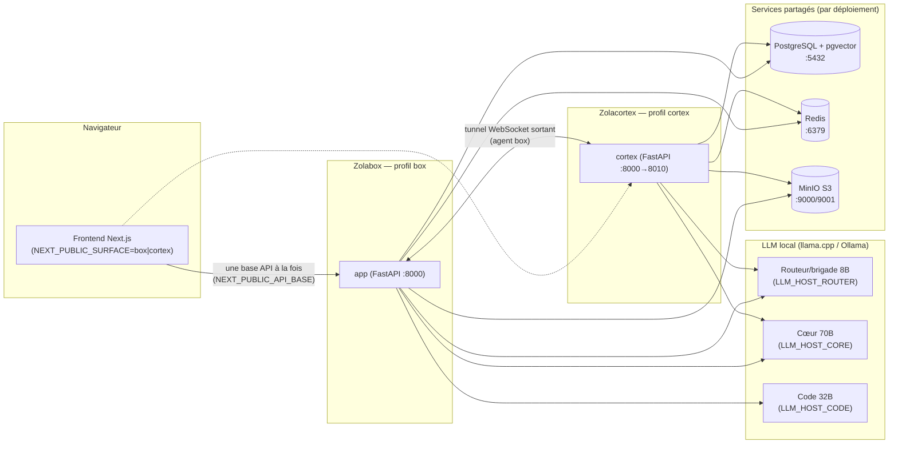
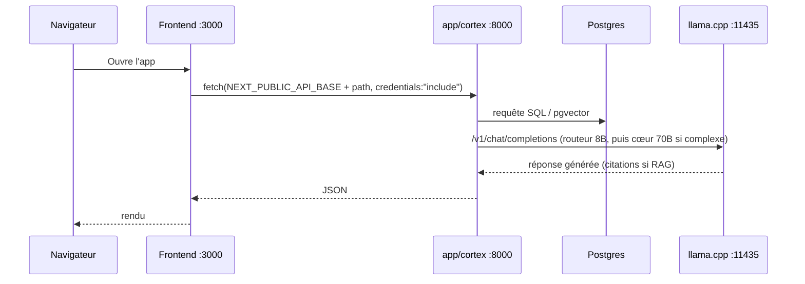
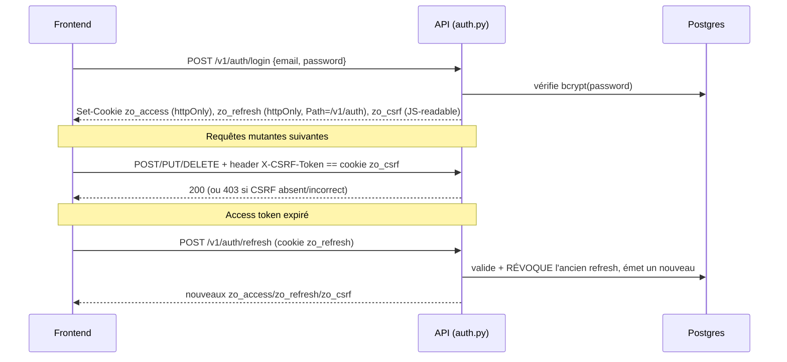

# ZolaOS — Documentation technique IT (Zolabox + Zolacortex)

**Public** : administrateurs systèmes, DevOps, développeurs qui installent, exploitent ou intègrent ZolaOS.
**Portée** : les deux faces du même moteur — **Zolabox** (déploiement chez le client) et **Zolacortex** (cockpit cabinet Polaris) — en développement et en production.
**Ce document ne remplace pas** la documentation détaillée existante ; il l'indexe et la relie. Références utilisées : `docs/ARCHITECTURE_TOPOLOGIE.md`, `docs/PRODUCTION_HYBRID.md`, `docs/AUTH_PRODUCTION.md`, `docs/RAG_INGESTION.md`, `docs/LICENSING.md`, `docs/ETAT_PROJET.md`, `deploy/OPERATIONS.md`, `deploy/zolabox/README.md`, `deploy/zolacortex/README.md`.

---

## 1. Vue d'ensemble

ZolaOS est **un seul moteur** (orchestrateur + agents + clients LLM), packagé selon **deux topologies** de déploiement, contrôlées par une seule variable d'environnement : `ZOLAOS_PROFILE`.

| Topologie | Profil | Où | Contient |
|---|---|---|---|
| **Zolabox** | `box` | Chez le client | Le moteur + modules métier vendables + données du client (actifs publics uniquement) |
| **Zolacortex** | `cortex` | Chez Polaris | Le même moteur + cockpit cabinet (comptes, clients, missions, facturation, PSA) + overlays propriétaires + modèle lourd |
| *(headless)* | `engine` | API générique | Surface minimale (`v1_router` + auth), sans modules verticaux ni frontend — cf. `docs/ARCHITECTURE_TOPOLOGIE.md` §5 |

**Doctrine transverse, tenue dans tout le code** : le **chiffre est déterministe** (barèmes, règles métier en code/données), le **LLM local sert à interpréter, rédiger et citer** — jamais à inventer un montant, un article de loi ou un fait. Deux garde-fous s'appliquent partout où le LLM touche à du contenu ancré : `requires_citation` (abstention si le corpus ne rend aucun extrait) et `min_confidence`. Détail de la frontière moteur/connaissance : `docs/ARCHITECTURE_TOPOLOGIE.md` §3.

Toute l'inférence est **locale et souveraine** : le fallback vers une API externe (Anthropic) est **désactivé par défaut** (`ENABLE_EXTERNAL_FALLBACK=false`) et gardé au niveau du client LLM (`zolaos/llm/factory.py`).

### 1.1 Architecture (vue logique)



Points clés :
- **Même codebase** des deux côtés : la différence est de **configuration et de données**, jamais de code (`docs/ARCHITECTURE_TOPOLOGIE.md` §4).
- En développement, box et cortex partagent le **même** Postgres/Redis/MinIO/LLM (deux conteneurs applicatifs sur une seule infra). En production hybride, chaque partie a sa **propre** pile (cf. §12) reliée uniquement par le tunnel applicatif.
- Le tunnel Zolabox → Zolacortex est **sortant** : la box compose vers le cortex, jamais l'inverse (aucun port entrant côté client).

---

## 2. Composants & ports

| Composant | Rôle | Port(s) | Conteneur (dev) |
|---|---|---|---|
| Frontend Next.js | UI web (box ou cortex selon `.env.local`) | **3000** | hors Docker (`npm run dev`) |
| API **box** | Moteur + modules client (profil `box`) | **8000** | `zolaos-app` |
| API **cortex** | Cockpit cabinet (profil `cortex`) | **8010** (hôte) → 8000 (interne conteneur) | `zolaos-cortex` |
| PostgreSQL + pgvector | Source unique de vérité (relationnel + vectoriel) | **5432** | `zolaos-postgres` (image `pgvector/pgvector:pg16`) |
| Redis | Cache + rate limiting + broker | **6379** | `zolaos-redis` |
| MinIO | Stockage objet S3 (PDF, livrables, imports) | **9000** (API S3) / **9001** (console) | `zolaos-minio` |
| LLM local | Serveur d'inférence (llama.cpp ou Ollama) | **11435** (routeur+cœur en dev), 11436 (code, si activé) | natif Windows (hors Docker) |
| Caddy (optionnel) | Reverse proxy + TLS | 80 / 443 | `zolaos-caddy` (profil `with-proxy`) |
| Prometheus / Grafana (optionnel) | Observabilité | 9090 / 3001 | profil `observability` |

> Le conteneur applicatif expose toujours `8000` **en interne** ; c'est le mapping hôte qui distingue box (`8000:8000`) et cortex (`8010:8000`) — cf. `docker-compose.dev.yml`.

### 2.1 Flux d'une requête (dev)



---

## 3. Profils & routage

Le profil actif (`Settings.ZOLAOS_PROFILE`, défaut `box`) détermine **quels routers FastAPI sont montés** dans `src/zolaos/api/main.py`. Ce n'est pas un filtre d'affichage : un router non monté **n'existe pas** dans l'application (404, absent de l'OpenAPI).

```mermaid
flowchart TD
    Start["create_app(settings)"] --> Core["Toujours monté :\nv1_router, openai_compat, jurisdictions,\nauth, auth_dev"]
    Core --> BoxCortex{"profil ∈ {box, cortex} ?"}
    BoxCortex -->|oui| Common["config, feedback, kb, legal, commons"]
    BoxCortex -->|non (engine)| Skip["rien de plus — headless"]
    Common --> IsBox{"profil == box ?"}
    IsBox -->|oui| BoxRoutes["require_box_auth + require_box_csrf\nbox, box_entitlement,\nERP/CRM/BI/SIRH/Fintech/Cyber/GRC/Code\n(montage conditionné par l'entitlement)"]
    Common --> IsCortex{"profil == cortex ?"}
    IsCortex -->|oui| CortexRoutes["cortex, cortex_accounts, cortex_clients,\ncortex_entitlements, cortex_fleet, cortex_audit,\ncortex_billing, cortex_psa, cortex_invoices,\ncortex_pipeline, cortex_dashboard, cortex_expenses,\ncortex_staffing, cortex_ged, tunnel"]
```

Conséquences pratiques :

- **`box` et `cortex` ne sont pas des sur-ensembles l'un de l'autre.** Box expose les modules métier vendables (ERP, CRM, BI, SIRH, Fintech, Cyber, GRC, Code) sous garde `require_box_auth` + `require_box_csrf` + entitlement ; cortex expose le cockpit cabinet (`/v1/cortex/*`) — comptes, clients, missions, facturation, PSA, GED, tunnel. Un appel à `/v1/cortex/...` sur une box (ou `/v1/erp/...` sur le cortex) renvoie **404**, pas 403 (ne révèle pas l'existence de la route).
- **Le profil `box` monte les modules verticaux sous contrôle d'entitlement** (`_mount_module` dans `main.py`) : un module non couvert par la licence signée n'est **pas monté**, quel que soit le rôle de l'utilisateur (cf. §12, `docs/LICENSING.md`).
- **Une seule base API par face côté frontend** : le frontend est une app Next.js unique, paramétrée par `NEXT_PUBLIC_API_BASE` (URL de l'API) + `NEXT_PUBLIC_SURFACE` (`box` ou `cortex`, cf. `frontend/.env.local`). Pointer le frontend « box » vers `:8010` (cortex) exposerait des écrans sans backend correspondant — box et cortex sont **deux instances de la même app**, une base à la fois, pas un routage dynamique inter-face.
- Le fichier `src/zolaos/core/profiles.py` fournit aussi des gardes **applicatives** (`require_cortex`, `require_box`, décorateurs `@cortex_only` / `@box_only`) pour du code partagé qui doit rester réservé à un profil, indépendamment du montage des routers.

---

## 4. Installation & démarrage (dev)

### 4.1 Prérequis

- Docker Desktop (Windows/Linux/macOS) + Docker Compose v2.
- Node.js + npm (frontend).
- Un serveur LLM local OpenAI-compatible (llama.cpp) ou Ollama, capable de servir Llama-3-8B (routeur) et idéalement Llama-3-70B (cœur) — **non démarré par les scripts**, à lancer séparément.
- (Optionnel mais recommandé pour le RAG) le modèle d'embeddings **bge-m3** disponible localement (dossier monté en lecture seule).

### 4.2 `pwsh scripts/dev_up.ps1` — pas à pas

```powershell
pwsh scripts/dev_up.ps1          # mode staging : login réel (comme la prod)
pwsh scripts/dev_up.ps1 -Dev     # mode dev : APP_ENV=dev, auto-login (dev-token)
```

Ce que fait le script, dans l'ordre :

1. **Vérifie Docker** (le démarre si Docker Desktop est installé mais arrêté).
2. **Écrit dans `.env`** : `APP_ENV` (staging par défaut, `dev` avec `-Dev`), `AUTH_COOKIE_SECURE=false` (cookies utilisables sur `http://localhost`), `TUNNEL_CORTEX_URL=ws://zolaos-cortex:8000/v1/tunnel/connect`.
3. **Génère `docker-compose.local.yml`** (non versionné) si le dossier bge-m3 (`C:\Users\duqat\bge-m3` par défaut, paramétrable via `-BgeM3Path`) existe : monte le modèle sur `app` **et** `cortex`, positionne `EMBEDDING_MODEL=/opt/bge-m3` et `HF_HUB_OFFLINE=1`. Absent → RAG sémantique désactivé pour cette session.
4. **Lève `app` + `cortex`** (`docker compose -f docker-compose.yml -f docker-compose.dev.yml [-f docker-compose.local.yml] up -d app cortex`) et attend `/health` sur les deux (:8000 et :8010).
5. **Applique les migrations** : `alembic upgrade head` dans le conteneur `app`.
6. **Sème** (`scripts/dev_seed.py`, idempotent) : crée un admin (login réel), un tenant cabinet et un tenant client, et un **credential de box** neuf ; injecte `ZOLAOS_BOX_TENANT_ID` / `ZOLAOS_BOX_CREDENTIAL` dans `.env`, puis **recrée** le conteneur `app` (`--force-recreate`) pour que l'agent tunnel démarre avec ce credential. Vérifie dans les logs du cortex l'apparition de `tunnel.box_connected`.
7. **Démarre le frontend** (nouvelle fenêtre PowerShell, `npm run dev` avec `NEXT_PUBLIC_API_BASE=http://localhost:8000`) s'il ne tourne pas déjà.
8. **Sonde le LLM** sur `http://localhost:11435/v1/models` — avertit (sans bloquer) s'il est absent.

Le script **ne démarre pas le LLM** : le lancer séparément (llama-server ou `ollama serve`) avant d'utiliser l'assistant, sinon les réponses générées échoueront (les endpoints déterministes, eux, fonctionnent sans LLM).

### 4.3 Lancer le frontend manuellement (box vs cortex)

Le frontend est une app Next.js unique ; la face servie dépend de `frontend/.env.local` (voir `frontend/.env.example`) :

```env
NEXT_PUBLIC_SURFACE=box                      # ou cortex
NEXT_PUBLIC_API_BASE=http://localhost:8000   # :8010 pour pointer sur le cortex
NEXT_PUBLIC_API_TOKEN=                       # optionnel en dev
```

```powershell
cd frontend
npm install     # première fois
npm run dev     # http://localhost:3000
```

Pour ouvrir les deux faces en parallèle en dev, lancer deux instances du frontend sur des ports différents (`-p 3001` par ex.) avec deux `.env.local` distincts, ou basculer `NEXT_PUBLIC_API_BASE` selon la face testée.

### 4.4 Vérifications de santé

```powershell
Invoke-WebRequest http://localhost:8000/health   # box
Invoke-WebRequest http://localhost:8010/health   # cortex
Invoke-WebRequest http://localhost:11435/v1/models   # LLM local
```

`/health` retourne `{"status":"ok", "version":..., "env":..., "country":"cg", "external_fallback_enabled":false}`. `external_fallback_enabled` doit **toujours** être `false` en exploitation normale — `true` signalerait une dérive de configuration vers un LLM externe.

---

## 5. Configuration

La configuration est centralisée dans `src/zolaos/core/settings.py` (Pydantic `BaseSettings`, source `.env` + environnement). Composes concernés : `docker-compose.yml` (base, service `app` = profil box), `docker-compose.dev.yml` (service `cortex` = profil cortex + override dev de `app`), `docker-compose.local.yml` (généré par `dev_up.ps1`, montage bge-m3).

### 5.1 Variables clés

| Variable | Rôle | Défaut (settings.py) |
|---|---|---|
| `ZOLAOS_PROFILE` | `box` \| `cortex` \| `engine` — détermine les routers montés | `box` |
| `APP_ENV` | `dev` \| `staging` \| `prod` — active `dev-token`, cookies `Secure`, etc. | `dev` |
| `LLM_BACKEND` | `llamacpp` (OpenAI-compatible) ou `ollama` | `llamacpp` |
| `LLM_HOST_ROUTER` | Hôte du routeur/brigade (8B) | `http://host.docker.internal:11434` |
| `LLM_MODEL_BRIGADE` | Modèle de la brigade (agents métier) | `llama-3-8b` |
| `LLM_HOST_CORE` | Hôte du méta-agent Planning (70B) | `http://host.docker.internal:11435` |
| `LLM_MODEL_CORE` | Modèle du cœur | `llama-3-70b` |
| `LLM_CORE_ON_COMPLEXITY` | Niveaux de complexité routés vers le 70B (`simple,moderate,complex`) | `complex` |
| `LLM_HOST_CODE` | Hôte de l'assistant code souverain | `http://host.docker.internal:11436` |
| `LLM_MODEL_CODE` | Modèle code | `qwen2.5-coder-32b` |
| `EMBEDDING_MODEL` | Modèle d'embeddings RAG | `BAAI/bge-m3` |
| `EMBEDDING_DIMENSION` | Dimension des vecteurs pgvector | `1024` |
| `RAG_HYBRID_RERANK_ENABLED` | Reranking hybride dense+lexical (déterministe, offline) | `true` |
| `AUTH_COOKIE_SECURE` | `Secure` sur les cookies d'auth (`null` = auto : `true` hors dev) | `None` (auto) |
| `AUTH_COOKIE_SAMESITE` | `lax` \| `strict` \| `none` | `lax` |
| `JWT_EXPIRE_MINUTES` | Durée de l'access token | `60` |
| `JWT_REFRESH_EXPIRE_DAYS` | Durée du refresh token | `30` |
| `CORS_ORIGINS` | Origines autorisées (liste séparée par virgules) | `http://localhost:3000` |
| `ENABLE_EXTERNAL_FALLBACK` | Autorise un appel LLM externe (Anthropic) | `false` |
| `ENTITLEMENT_ENFORCED` | Active le contrôle d'entitlement des modules (profil box) | `false` |
| `ENTITLEMENT_PUBLIC_KEY` | Clé publique RS256 de vérification (PEM, box uniquement) | vide |
| `ENTITLEMENT_PRIVATE_KEY` | Clé privée d'émission (PEM, **cortex uniquement**) | vide |
| `TUNNEL_CORTEX_URL` | URL WebSocket du cortex (côté box, connexion sortante) | vide (tunnel désactivé) |
| `ZOLAOS_BOX_TENANT_ID` / `ZOLAOS_BOX_CREDENTIAL` | Identité présentée par la box au handshake du tunnel | vide |
| `TUNNEL_REQUIRE_CLIENT_CERT` | Exige un mTLS terminé au proxy en plus du credential | `false` |
| `RATE_LIMIT_PER_MINUTE` | Limite de requêtes par identifiant (Redis) | `60` |

> En dev (`.env` actuel du dépôt), `LLM_HOST_ROUTER` **et** `LLM_HOST_CORE` pointent tous deux `http://host.docker.internal:11435` (un unique `llama-server` sert alternativement le 8B et le 70B, faute de deuxième port dédié) — les défauts de `settings.py` (11434/11435) supposent deux serveurs distincts. Adapter selon le nombre de processus LLM réellement lancés.

Ne jamais committer un `.env` rempli de secrets (le `.env` de dev local est explicitement documenté comme non versionnable). En production, servir les secrets (`JWT_SECRET`, `API_KEY_PEPPER`, mots de passe Postgres/Redis/MinIO, clés d'entitlement) **depuis un coffre**, jamais en clair dans le dépôt.

---

## 6. Authentification & sécurité

Détail complet et étapes de mise en production : `docs/AUTH_PRODUCTION.md`. Résumé opérationnel :

### 6.1 Flux login / refresh / CSRF



- Trois cookies : **`zo_access`** (JWT, httpOnly, `Path=/`, ~1h par défaut), **`zo_refresh`** (opaque, httpOnly, `Path=/v1/auth`, ~30j), **`zo_csrf`** (lisible par JS, rejoué en en-tête `X-CSRF-Token` — double-submit, combiné à `SameSite=lax`). Implémentation : `src/zolaos/api/cookies.py`.
- **Rotation** : chaque `refresh` révoque l'ancien refresh token (défense anti-rejeu).
- `AUTH_COOKIE_SECURE` : `false` en local (HTTP), forcé `true` hors dev par défaut (HTTPS obligatoire).
- **RBAC** (`src/zolaos/core/rbac.py`) : trois rôles — `admin` (scopes `admin:users` + `commons:curate`), `consultant` (scope `commons:curate`), `client` (aucun scope). Le rôle est **stocké** sur l'utilisateur ; les scopes en sont une **projection** au login (jamais l'inverse). Endpoints privilégiés observés : `require_admin` (scope `admin:users`, cockpit cabinet), `require_curator` (scope `commons:curate`).
- `dev-token` (`POST /v1/auth/dev-token`, `src/zolaos/api/v1/auth_dev.py`) : auto-login sans vérifier d'identifiants, **404 hors `APP_ENV=dev`** — jamais un chemin de production.
- CORS : `allow_credentials=True` avec origines **exactes** (`CORS_ORIGINS`), jamais `*` avec credentials.

### 6.2 Garde-fou frontend contre le « login furtif »

`frontend/src/lib/api.ts` (fonction `api()`) gère les 401 en trois temps avant d'éjecter l'utilisateur : (1) tente un `refreshSession()` silencieux ; (2) à défaut, replie sur `fetchDevToken()` (no-op hors dev, 404) ; (3) avant de rediriger vers `/login`, **reconfirme** via `GET /v1/auth/me` — un 401 transitoire (course au chargement) ne doit pas déconnecter une session encore valide. Ce n'est qu'après un `me()` négatif que la redirection a lieu.

### 6.3 Audit

Toutes les actions sensibles (émission/révocation de licence, gestion des comptes, credentials de box, missions) sont tracées dans `audit.log`, avec **chaîne de hash** (`payload_hash` / `prev_hash` / `row_hash`, calculée par triggers) et table **append-only** (triggers `forbid_mutation` — aucun `UPDATE`/`DELETE` possible, même par le rôle applicatif). Écriture via `record_audit()`. Consultation côté cockpit : `/v1/cortex/audit` (profil cortex, réservé admin).

---

## 7. Données & migrations

- **PostgreSQL 16 + pgvector** (`pgvector/pgvector:pg16`) est la **source unique de vérité**, relationnelle et vectorielle. Schémas créés au bootstrap (`infra/postgres/01_init_schemas.sql`, `02_audit_log.sql`) : `core` (utilisateurs, tenants, config…), `audit` (journal append-only), et les schémas RAG `rag_legal`, `rag_erp`, `rag_health`, `rag_cyber`, `rag_fintech`, `rag_tenant`, `rag_commons`, `rag_code`.
- **Rôles Postgres séparés** (moindre privilège) : `zolaos_migrator` (DDL, propriétaire des schémas), `zolaos_app` (SELECT/INSERT applicatif — n'a que le **SELECT** sur les schémas `rag_*`, l'ingestion étant une opération d'administration hors chemin applicatif), rôles de lecture dédiés par pôle (`PWD_HEALTH`, `PWD_LEGAL`, `PWD_ERP`, `PWD_CODE`, `PWD_AUDIT_R`/`PWD_AUDIT_W`).
- **Migrations Alembic** (~70 révisions au dépôt) :
  ```bash
  docker exec zolaos-app python -m alembic upgrade head
  docker exec zolaos-app python -m alembic current      # révision appliquée
  docker exec zolaos-app python -m alembic history       # historique
  ```
  `dev_up.ps1` les applique automatiquement à chaque démarrage.
- **MinIO** (S3-compatible) stocke les objets binaires : PDF, livrables générés (`.docx`), imports Excel, CV. Bucket par défaut : `zolaos` (`MINIO_BUCKET_DEFAULT`). Console d'administration sur `:9001`.
- **Système de référence léger (persistance métier)** : tables `store_*` par tenant (factures, écritures, stocks, feuilles de temps…) — cf. `docs/PERSISTENCE_ROADMAP.md` pour la feuille de route entité par entité.

---

## 8. RAG & corpus

Procédure d'ingestion détaillée, prérequis et vérifications : **`docs/RAG_INGESTION.md`**. Résumé :

- **Embeddings** : `BAAI/bge-m3` (1024 dimensions), pré-embarqué au **build** de l'image (`/opt/hf_cache`, `HF_HOME`) pour un fonctionnement **offline** au runtime (`HF_HUB_OFFLINE=1`) — les téléchargements anonymes du Hub HuggingFace sont bridés, fournir un `HF_TOKEN` au build est recommandé. En dev local, `dev_up.ps1` peut aussi **monter** un dossier bge-m3 local (`EMBEDDING_MODEL=/opt/bge-m3`) plutôt que de rebuilder l'image.
- **Schémas** : `rag_legal` (droit OHADA/travail/fiscal/administratif), `rag_erp` (comptable AUDCIF, ERP), `rag_health` (santé/pharmaco), `rag_cyber` (NIST/OWASP/MITRE + lois CG), `rag_fintech` (microfinance COBAC), `rag_tenant` (corpus **privé, cloisonné par tenant** — uploads clients), `rag_commons` (savoir dérivé/validé, opt-in), `rag_code` (code source client indexé, box uniquement).
- **Retrieval hybride** : dense (similarité cosinus bge-m3) + reranking lexical déterministe (BM25-léger, 100% offline), pondérés par `RAG_HYBRID_DENSE_WEIGHT` / `RAG_HYBRID_LEXICAL_WEIGHT`, sur un pool élargi (`RAG_HYBRID_FETCH_MULTIPLIER` × k).
- **Garde-fous d'ancrage** (`src/zolaos/agents/rag_agent.py`) : `requires_citation=True` → lève `InsufficientContextError` **avant toute génération** si le corpus ne rend aucun extrait pertinent (abstention plutôt qu'invention) ; `min_confidence` filtre les extraits trop peu similaires. Toute réponse ancrée porte ses citations (`[1]`, `[2]`…).
- **Idempotence & PII** : ingestion par clé `(source_uri, chunk_index)` (`ON CONFLICT DO NOTHING`), politique de rédaction PII explicite par schéma sensible (`FISCAL`, `RH`, `MEDICAL`, `NONE` pour du texte légal public).

---

## 9. LLM

| Client (factory) | Modèle par défaut | Usage | Host (settings) |
|---|---|---|---|
| `make_router_client` | `LLM_MODEL_BRIGADE` = `llama-3-8b` | Routage de requête, agents métier (brigade) | `LLM_HOST_ROUTER` |
| `make_core_client` | `LLM_MODEL_CORE` = `llama-3-70b` | Méta-agent Planning, génération sur cas **complexes** sélectifs (`LLM_CORE_ON_COMPLEXITY`) | `LLM_HOST_CORE` |
| `make_code_client` | `LLM_MODEL_CODE` = `qwen2.5-coder-32b` | Assistant code souverain (profil box, module `code`) — **dérogation assumée** à la stack Llama, le code ne quitte jamais la box | `LLM_HOST_CODE` |

- **Backend** : `LLM_BACKEND=llamacpp` par défaut (serveur OpenAI-compatible, `/v1/chat/completions`) ; `ollama` alternative (`/api/chat`). Implémentations : `src/zolaos/llm/lcpp_client.py`, `src/zolaos/llm/ollama_client.py`.
- **Souveraineté** : `make_external_client` (Anthropic) existe mais son usage réel est gardé par `ENABLE_EXTERNAL_FALLBACK` — désactivé par défaut, jamais sollicité par le chemin normal (`pick_client` ne le retourne que si `prefer_external=True` **et** le flag actif).
- **Health check** : `GET http://<host_llm>:11435/v1/models` (endpoint standard OpenAI-compatible) — c'est ce que `dev_up.ps1` sonde avant de conclure que le LLM est disponible.
- **Timeout** : `LLM_TIMEOUT_SECONDS` (300s en dev — le 70B sur iGPU sans GPU dédié peut être très lent, cf. contrainte de latence documentée dans le journal projet).

---

## 10. Le « + » IA (surfaces cortex) — `run_draft` et la doctrine « je cite, je ne tranche pas »

Le cockpit cabinet (profil cortex) expose plusieurs surfaces génératives qui suivent **le même patron** : retrieve ancré → abstention avant génération si le corpus ne couvre pas → génération citée → statut explicite. Implémentation centrale : `src/zolaos/ged/drafting.py` (fonction `run_draft`).

### 10.1 Patron `run_draft`

```
run_draft(settings, schema=<rag_*>, tags=[...], query=..., system_prompt=...)
  → DraftOutcome(status, content, citations)
```

Trois statuts possibles, jamais d'exception qui remonte à l'appelant :

| Statut | Sens | Déclencheur |
|---|---|---|
| `generated` | Contenu produit et cité | Retrieve OK + LLM OK |
| `abstained` | Refus **avant génération** | `InsufficientContextError` (corpus ne couvre pas le sujet) |
| `unavailable` | Panne technique | Retrieval/embeddings ou LLM local indisponible |

Le pôle (droit/erp/santé/cyber/fintech) sélectionne le schéma RAG via `POLE_SCHEMAS` / `pole_from_offre()` ; chaque système de prompt (rédaction, proposition, relecture, mémo) interdit explicitement au modèle d'inventer une valeur chiffrée ou une référence hors des textes fournis, et de mentionner le mécanisme interne (« RAG », « extraits »).

### 10.2 Surfaces livrées (GED, `src/zolaos/ged/`)

| Surface | Fichier | Entrée → sortie |
|---|---|---|
| Rédaction assistée de livrable | `drafting.py` (`_DRAFT_SYSTEM_PROMPT`) | Titre + squelette de sections → projet de livrable cité |
| Proposition commerciale | `drafting.py` (`PROPOSAL_SYSTEM_PROMPT`) | Type de mission + client → lettre de mission (sans chiffrage d'honoraires) |
| Relecture qualité (contrôle d'ancrage) | `drafting.py` (`REVIEW_SYSTEM_PROMPT`, `build_review_query`) | Projet existant → revue structurée (bien étayé / à vérifier / manquant) |
| Mémo réglementaire savable | `drafting.py` (`MEMO_SYSTEM_PROMPT`, `build_memo_query`) | Question précise → note réponse/fondement/limites |
| Synthèse d'entretien | `synthesis.py` | Notes brutes → compte rendu structuré |

Câblage HTTP : `src/zolaos/api/v1/cortex_ged.py` (modèles de livrables + documents de mission, versionnés).

### 10.3 Surfaces déterministe + narration (PSA, `src/zolaos/psa/`)

Doctrine complémentaire : **« le moteur calcule, le LLM narre »** — le calcul (temps, honoraires, marge, seuils) est **toujours** déterministe ; le LLM ne fait que reformuler/prioriser des chiffres qu'il ne recalcule jamais.

| Surface | Fichier | Détection (déterministe) | Narration (IA, optionnelle) |
|---|---|---|---|
| Saisie de temps assistée | `time_assist.py` | — | Récit libre → lignes de temps proposées (relecture humaine avant validation) |
| Alertes marge & sous-facturation | `alerts.py` (`scan_mission`) | Seuils `PSA_MARGIN_LOW_PCT`, `PSA_WIP_ALERT_XAF`, `PSA_MIN_HONORAIRES_XAF` → `Alert(type, severity, metrics)` (`marge_negative`, `marge_faible`, `sous_facturation`) | Reformulation courte des alertes détectées, sans inventer ni recalculer de chiffre ; `unavailable` si le LLM échoue, `empty` si aucune alerte |

Câblage HTTP : `src/zolaos/api/v1/cortex_psa.py`.

---

## 11. Exploitation

### 11.1 Santé & logs

```bash
docker compose ps                          # état des conteneurs
docker logs zolaos-app --tail 100 -f       # logs box (dev)
docker logs zolaos-cortex --tail 100 -f    # logs cortex (dev)
docker logs zolaos-cortex --since 30s | grep tunnel   # vérifier la connexion tunnel
curl http://localhost:8000/health
curl http://localhost:8000/metrics         # format Prometheus
```

### 11.2 Recréer un service (après un changement de `.env` par ex.)

```bash
docker compose -f docker-compose.yml -f docker-compose.dev.yml up -d --force-recreate app
docker compose -f docker-compose.yml -f docker-compose.dev.yml up -d --force-recreate cortex
```

### 11.3 Sauvegardes

Postgres est la source unique de vérité (relationnel + vectoriel) — la seule sauvegarde réellement critique. En production, `deploy/scripts/backup.sh` (cron quotidien recommandé) et `deploy/OPERATIONS.md` documentent la procédure pour box **et** cortex :

```sh
PG_CONTAINER=zolabox-postgres    deploy/scripts/backup.sh /var/backups/zolabox 14
PG_CONTAINER=zolacortex-postgres deploy/scripts/backup.sh /var/backups/zolacortex 30
# restauration
gunzip -c /var/backups/zolabox/zolaos-<horodatage>.sql.gz | docker exec -i zolabox-postgres psql -U postgres -d zolaos
```

Volumes persistants à couvrir également si besoin : `*_minio_data`, `*_ollama_data` (ou équivalent llama.cpp).

### 11.4 Dépannage courant

| Symptôme | Cause probable | Action |
|---|---|---|
| L'assistant / les audits ne répondent pas | LLM local absent sur le port attendu (11435) | Lancer `llama-server`/`ollama serve` ; vérifier `curl :11435/v1/models` |
| `docker compose up` échoue immédiatement | Docker Desktop arrêté | `dev_up.ps1` tente de le relancer automatiquement ; sinon démarrer Docker Desktop manuellement |
| Port déjà utilisé (`8000`, `8010`, `3000`…) | Un ancien conteneur ou processus occupe le port | `docker compose ps` / `netstat -ano \| findstr <port>`, arrêter le conflit |
| Frontend renvoie vers `/login` alors que la session semble valide (« login furtif ») | 401 transitoire mal géré, ou `NEXT_PUBLIC_API_BASE` pointant la mauvaise face | Vérifier `frontend/.env.local` (base API + `NEXT_PUBLIC_SURFACE` cohérents avec le backend visé) ; le garde-fou `api()` (§6.2) doit reconfirmer via `/v1/auth/me` avant d'éjecter — si ça déconnecte quand même, vérifier les cookies (`Secure`/`SameSite`) et l'horloge du JWT |
| Tunnel box→cortex jamais connecté | `TUNNEL_CORTEX_URL` absent, credential invalide/révoqué, réseau sortant bloqué | `docker logs zolaos-cortex \| grep tunnel` ; vérifier `ZOLAOS_BOX_CREDENTIAL` côté box et son statut côté cockpit (`/v1/cortex/clients`) |
| Module métier absent (404) en profil box | Entitlement non couvert (`ENTITLEMENT_ENFORCED=true`) ou router simplement non pertinent au profil courant | Vérifier `/v1/box/entitlement/status`, cf. `docs/LICENSING.md` |
| RAG ne retrouve rien / répond en abstention systématique | Corpus non ingéré, embeddings absents, ou mauvais `EMBEDDING_MODEL` | `docs/RAG_INGESTION.md` — vérifier la présence de `/opt/hf_cache` ou du montage bge-m3, relancer une ingestion |

---

## 12. Déploiement en production (hybride)

Référence complète : **`docs/PRODUCTION_HYBRID.md`** (flux Zero Trust détaillé, backlog) et **`docs/LICENSING.md`** (entitlement). Bundles opérationnels prêts à l'emploi : `deploy/zolabox/`, `deploy/zolacortex/`, `deploy/OPERATIONS.md`, `deploy/PILOT.md`.

### 12.1 Modèle hybride

- **Zolabox** tourne **sur le serveur du client** : profil `box`, Postgres/Redis/MinIO/Ollama (8B local) + Caddy (HTTPS), image **allégée des actifs propriétaires Polaris** (`strip_polaris_assets.sh` au build). Le 70B ne tourne **jamais** sur la box.
- **Zolacortex** tourne **chez Polaris** : profil `cortex`, pile équivalente + Ollama **8B et 70B**, conserve les overlays et prompts de mission. C'est le point d'entrée du tunnel (le seul port entrant du système, côté Polaris).
- **Tunnel sortant** : la box compose une connexion WebSocket sortante vers le cortex (`TUNNEL_CORTEX_URL=wss://<domaine_tunnel>/v1/tunnel/connect`) — **aucun port entrant côté client**. En production, le tunnel est protégé par **deux couches** : mTLS au reverse-proxy (certificat client par box, signé par une CA Polaris — `deploy/zolacortex/pki/issue_box_cert.sh`) **et** un credential applicatif par box (révocable immédiatement depuis le cockpit).
- **Zero Trust Client** : les prompts de mission et l'inférence du cabinet restent **chez Polaris** ; la Zolabox n'héberge que des actifs publics (V2.2). Une mission interroge le RAG du client à distance (`MissionClient`, jeton de mission éphémère scopé) sans jamais rapatrier les données brutes.

### 12.2 Installation (bundles `deploy/`)

```sh
# Côté client (Zolabox)
cd deploy/zolabox
cp .env.zolabox.example .env    # renseigner ZOLAOS_BOX_TENANT_ID, ZOLAOS_BOX_CREDENTIAL, TUNNEL_CORTEX_URL, ZOLABOX_DOMAIN
./install.sh admin@le-client.cg
./seed_corpus.sh corpus_public.dump   # corpus public fourni par Polaris

# Côté Polaris (Zolacortex)
cd deploy/zolacortex
cp .env.zolacortex.example .env   # renseigner CORTEX_DOMAIN, CORTEX_TUNNEL_DOMAIN
./install.sh admin@polaris.cg
./pki/issue_box_cert.sh <tenant_id>   # certificat client mTLS pour chaque box provisionnée
```

`install.sh` génère les secrets manquants, construit l'image dans le bon profil, démarre la pile, télécharge les modèles, applique les migrations et crée le compte admin (mot de passe affiché une fois). Provisioning bout-en-bout d'une box : cockpit cortex → fiche client → « Provisionner le credential », puis émission du certificat, puis installation côté box — détail dans `deploy/zolacortex/README.md`.

### 12.3 Entitlement des modules (RS256)

- La distribution des modules vendables (`erp · sirh · bi · crm · marketing · fintech · cyber · grc · code`) est **décidée par Polaris**, pas par le client : un `Entitlement` signé **RS256** (asymétrique) porte `tenant_id`, `tier`, `modules` optionnels, validité temporelle.
- La box ne détient que la **clé publique** (`ENTITLEMENT_PUBLIC_KEY`) — elle **vérifie**, elle ne peut **ni forger ni s'auto-accorder** un module. La clé privée d'émission n'existe que côté cortex (`ENTITLEMENT_PRIVATE_KEY`, jamais déployée sur une box).
- Enforcement **opt-in** (`ENTITLEMENT_ENFORCED`, défaut `false`) : à `true` en production, un module non couvert (ou une licence absente/expirée) n'est **pas monté** — 404, fail-closed. Livraison de la licence : jeton inline (`ENTITLEMENT_LICENSE_JWT`) ou fichier rafraîchi périodiquement par le tunnel (`ENTITLEMENT_LICENSE_FILE`, `ENTITLEMENT_REFRESH_SECONDS`).
- Détail complet, table des tiers, tests de non-falsifiabilité : `docs/LICENSING.md`.

### 12.4 Exploitation en production

Cf. `deploy/OPERATIONS.md` pour le détail (sauvegardes planifiées, mises à jour `update.sh`, supervision Prometheus/Grafana opt-in avec dashboard provisionné, alertes (`InstanceDown`, `HighHttpErrorRate`, `ExternalFallbackBlocked`, `LlmLatencyHigh`), et révocation d'une box (credential immédiat + certificat mTLS en défense en profondeur).

---

## 13. Licences & conformité

- **Cœur ZolaOS** : licence **AGPL v3** — partageable, base d'une éventuelle référence souveraine nationale (cf. `docs/ARCHITECTURE_TOPOLOGIE.md` §5).
- **Overlays Polaris** (prompts de mission, logique cabinet) : **propriétaires**, jamais distribués sur une Zolabox (modèle Zero Trust Client) — cf. `docs/LICENSING.md`.
- **Double licence commerciale** : le même cœur peut être distribué sous licence commerciale à des tiers, indépendamment de l'AGPL.
- **Llama-3** : modèle conservé **avec attribution** (Meta Llama 3 Community License) — aucune redistribution des poids hors des conditions de cette licence.
- **Corpus RAG** : chaque source ingérée est tracée (licence, attribution) dans `NOTICE` et `THIRD_PARTY_LICENSES.md` — voir aussi `docs/RAG_INGESTION.md` §0 et les rapports de sourcing (`docs/sourcing/`).

---

## Annexe — index des documents de référence

| Sujet | Document |
|---|---|
| Topologie moteur / Zolabox / Zolacortex, invariants API générique | `docs/ARCHITECTURE_TOPOLOGIE.md` |
| Déploiement hybride prod, backlog, PKI, tunnel | `docs/PRODUCTION_HYBRID.md` |
| Authentification de production, mise en service | `docs/AUTH_PRODUCTION.md` |
| Ingestion RAG (procédure, corpus OHADA) | `docs/RAG_INGESTION.md` |
| Entitlement / licence commerciale des modules | `docs/LICENSING.md` |
| État global du projet (archive consolidée) | `docs/ETAT_PROJET.md` |
| Runbook d'exploitation (sauvegardes, mises à jour, supervision, incidents) | `deploy/OPERATIONS.md` |
| Bundle Zolabox (installation client) | `deploy/zolabox/README.md` |
| Bundle Zolacortex (installation Polaris) | `deploy/zolacortex/README.md` |
| Pilote de déploiement | `deploy/PILOT.md` |
| Feuille de route persistance métier | `docs/PERSISTENCE_ROADMAP.md` |
